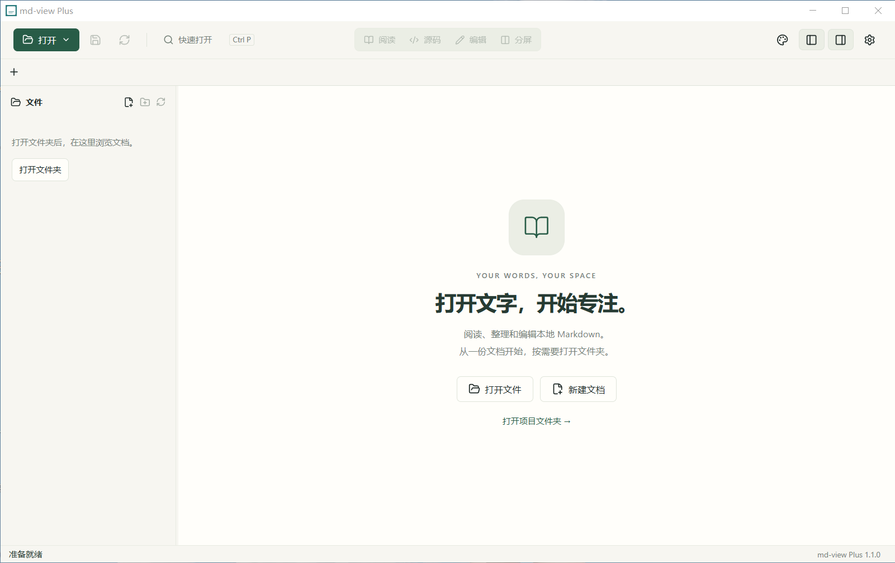

# md-view

[English](README.en.md)

md-view 是一个本地 Markdown 阅读和编辑器，使用 Tauri 2 + Svelte 5 + Vite 构建。它面向需要轻量、本地、可继续自行修改的 Markdown 工具用户。

> 本项目基于 [T-meow/md-view](https://github.com/T-meow/md-view) 二次开发与维护，感谢原作者。许可证为 WTFPL v2。

[产品介绍](https://t-meow.github.io/md-view/) · [在线体验](https://t-meow.github.io/md-view/play/) · [公开下载](https://github.com/T-meow/md-view/releases/latest)



## 项目特点

- **轻量本地**：使用系统 WebView，不依赖云服务；适合直接下载、打包、复制和本地使用。
- **按需加载**：单独打开文件只读取目标文档；文件夹按层加载，大型列表只渲染可见行。
- **多标签会话**：保留内容、源码撤销历史、视图模式和阅读位置。
- **多种视图**：阅读、源码编辑（CodeMirror）、可视化编辑、分屏预览。
- **大纲导航**：自动提取标题，支持快速跳转。
- **外观主题**：内置多套明暗主题，支持阅读区背景图。
- **文件管理**：新建、另存为、重命名、移动、回收站、复制路径、系统定位。
- **安全保存**：版本快照、冲突检查、原子替换；保留 UTF-8 / GBK / UTF-16、BOM 与换行风格。

## 功能一览

| 分类 | 说明 |
| --- | --- |
| 打开 | 本地 `.md` / `.markdown` 文件或文件夹 |
| 编辑 | 源码编辑、可视化编辑、分屏预览 |
| 预览 | GFM、代码高亮、表格、数学公式、Mermaid（Plus） |
| 大纲 | 标题提取与跳转（`Ctrl+P` 可搜索标题，Plus） |
| 草稿 | 自动草稿恢复；自动写回默认关闭 |
| 保存 | 冲突检测、另存为、编码/换行保留 |
| 搜索 | 已打开 / 最近 / 已加载文件；工作区索引按需启动 |
| 主题 | 多套内置主题、阅读背景图、沉浸模式 |
| 导出 | HTML 导出（Plus） |

### 快捷键

| 快捷键 | 作用 |
| --- | --- |
| `Ctrl+N` | 新建文档 |
| `Ctrl+O` | 打开文件 |
| `Ctrl+P` | 快速打开 |
| `Ctrl+S` | 保存 |
| `Ctrl+Shift+S` | 另存为 |
| `Ctrl+W` | 关闭标签 |
| `Ctrl+Tab` / `Ctrl+Shift+Tab` | 切换标签 |
| `F11` | 沉浸模式 |

macOS 可使用 Command 对应组合。

### 扫描与安全边界

- 默认不遍历链接和 junction。
- 遵循 `.gitignore`、`.ignore` 与自定义排除规则。
- 扫描限额：十万项 / 30 秒。
- 大于 2 MiB 的文档默认进入源码模式。

架构、接口、验收结果和后续开发约束见 [开发记录](docs/load-performance-plan.md)。

## Edition 策略

md-view 按 **Lite / Plus** 两个 edition 维护：

| | Lite | Plus |
| --- | --- | --- |
| 会话 / 文件管理 / 草稿 / 目录浏览 | ✓ | ✓ |
| 文件名搜索 | ✓ | ✓ |
| 高级渲染（公式、Mermaid、GFM 增强） | — | ✓ |
| 工作区标题索引 | — | ✓ |
| HTML 导出 / 高级阅读设置 | — | ✓ |

- `main` 维护共用桌面界面和文件能力，Plus 是高级渲染的开发基准。
- 默认开发和打包命令指向 Plus；构建 Lite 使用显式 `:*:lite` 命令。

## 技术栈

| 层 | 技术 |
| --- | --- |
| 桌面壳 | Tauri 2（Rust） |
| 前端 | Svelte 5 + TypeScript + Vite |
| 源码编辑 | CodeMirror 6 |
| 轻量渲染 | marked |
| Plus 渲染 | unified / remark / rehype、KaTeX、highlight.js、Mermaid |
| 测试 | Vitest、Rust `cargo test` |
| 类型检查 | `svelte-check` |

## 项目结构

```text
src/
  state/          # 文档会话、工作区、搜索、草稿、偏好
  components/     # 编辑器、预览、文件树、标签页等 UI
  markdown/       # 渲染管线（fast / lite / plus）与共享工具
  AppShell.svelte # 桌面主壳
src-tauri/        # Rust 后端（文件、扫描、监听、草稿）
site/             # 产品介绍页源码
tests/            # 端到端与回归测试
docs/             # 开发记录与语法样例
```

## 本地开发

需要先安装：

- Node.js 24 LTS（CI 使用 24）
- Rust stable ≥ 1.88（与锁文件依赖的最低要求一致）
- 系统对应的 Tauri 桌面依赖

```bash
npm ci --registry=https://registry.npmmirror.com/
npm run tauri:dev        # Plus
npm run tauri:dev:lite   # Lite
```

纯前端调试（不启动 Tauri）：

```bash
npm run dev:plus
npm run dev:lite
```

## 本地打包

```bash
npm install
npm run tauri:build          # 默认 Plus
npm run tauri:build:plus
npm run tauri:build:lite
npm run tauri:build:both     # 两个 edition
```

产物位置：

```text
src-tauri/target/release/bundle/
release/   # 规范化命名的安装包与 portable 可执行文件
```

当前配置会生成当前系统支持的包：

- Windows: NSIS installer
- macOS: DMG
- Linux: AppImage, DEB, RPM

这些是构建能力，不表示每个公开 Release 都提供全部平台。公开下载以 [Releases](https://github.com/T-meow/md-view/releases/latest) 为准。

Windows 本地默认使用 NSIS。需要尝试当前系统全部 bundle 目标时运行：

```bash
npm run tauri:build:all
```

## 产品页与在线体验

`site/` 为不加载编辑器的独立中英文介绍页；Svelte 在线体验位于 `/md-view/play/`。

```bash
npm run build:web
npm run check:web
```

| 目录 | 说明 |
| --- | --- |
| `dist/` | 桌面前端 |
| `dist-play/` | 在线体验中间产物 |
| `dist-site/` | 完整 Pages 产物 |

默认路径前缀为 `/md-view/`，可通过 `VITE_BASE_PATH` 设置。

## 开发检查

```bash
npm run check              # svelte-check
npm test                   # Vitest
npm run check:editions
npm run build:lite
npm run build:plus
cargo test --manifest-path src-tauri/Cargo.toml --lib --locked
cargo check --manifest-path src-tauri/Cargo.toml --locked
```

## 平台依赖

### Linux

Ubuntu/Debian 通常需要：

```bash
sudo apt-get update
sudo apt-get install -y build-essential curl wget file \
  libwebkit2gtk-4.1-dev libxdo-dev libssl-dev \
  libayatana-appindicator3-dev librsvg2-dev patchelf rpm
```

其他发行版按 Tauri 2 的 Linux 依赖安装对应包。

### macOS

本项目默认不做 Apple 签名和公证。朋友之间直接打包分发时，macOS 可能会因为 Gatekeeper 拦截未签名应用。正式公开分发前再补开发者证书、签名和公证流程。

## GitHub Actions

- `.github/workflows/pages.yml`：对 `main` 的 PR 构建官网与体验页并检查路由；仅 `main` 更新或手动触发时部署 Pages。
- `.github/workflows/build.yml`：
  - push 到 `plus` / `main` / `master` 时构建 Windows 和 macOS
  - pull request 时运行构建检查
  - 构建矩阵覆盖 Lite / Plus，产物名包含 edition 和版本号
  - 推送 `v*` tag 时创建草稿 Release 并上传产物

```bash
git tag v1.1.0
git push origin v1.1.0
```

## 贡献说明

本项目不接受 PR。你可以 fork 本仓库，然后使用 AI agent 或本地编辑器按自己的需求修改、打包和分发。

## 许可证和免责声明

许可证使用 [WTFPL v2](./LICENSE)。简单说：想怎么用就怎么用。

原项目版权归属见仓库 [LICENSE](./LICENSE) 文件与上游 [T-meow/md-view](https://github.com/T-meow/md-view)。

免责声明：本项目按原样提供，不提供任何明示或暗示担保。作者不保证它适合任何特定用途，也不对使用、修改、打包、分发或运行本项目造成的任何问题、损失或责任负责。使用者自行承担全部风险。
