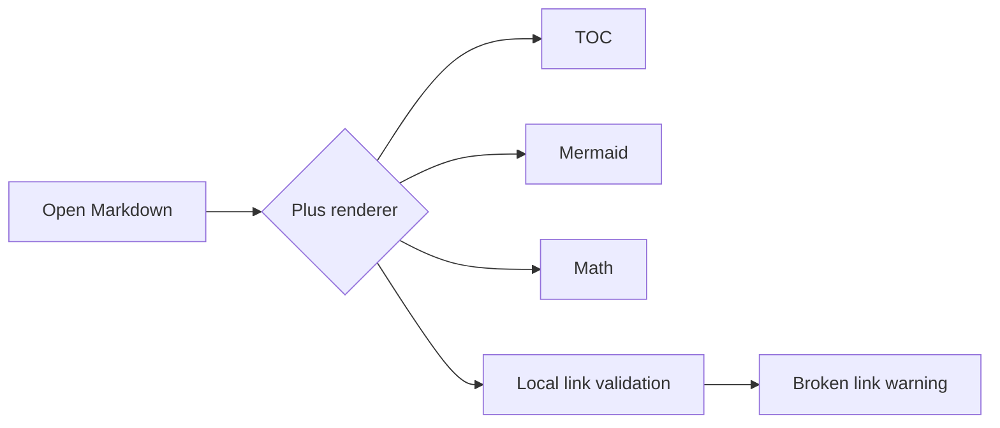

# Plus Feature Regression Test

[toc]

这份文件用于人工验收 Plus 阅读器新特性。重点检查：外部链接是否打开系统默认浏览器，本地链接校验是否提示异常，Frontmatter、TOC、Mermaid、数学、代码工具栏、图片预览和常见 Markdown 语法是否正常显示。

## 外部链接

以下链接应在系统默认浏览器或默认应用中打开，而不是在应用内浏览器里跳转：

- [OpenAI](https://openai.com/)
- [Tauri](https://tauri.app/)
- [VS Code Markdown](https://code.visualstudio.com/docs/languages/markdown)
- [发送邮件](mailto:test@example.com)
- [拨打电话](tel:+10000000000)

## 内部链接和本地链接校验

这些链接应该正常跳转或通过校验：

- [跳到 Mermaid 图表](#heading-mermaid-图表)
- [跳到任务列表](#heading-任务列表)
- [打开同目录语法样例](./plus-markdown-syntax-sample.md)
- [打开同目录语法样例的表格标题](./plus-markdown-syntax-sample.md#heading-表格)

这些链接故意用于测试断链提示：

- [不存在的本地文件](./missing-file.md)
- [不存在的标题](#heading-not-exists)
- [存在文件但不存在标题](./plus-markdown-syntax-sample.md#heading-not-exists)

## Frontmatter Properties

Plus 默认应把文件顶部 YAML 显示为只读 Properties 面板。请检查 `title`、`tags`、`aliases`、`date`、`author` 是否以属性形式呈现；切换设置里的 Frontmatter 模式后，应能显示 raw 或隐藏。

## Callout

> [!NOTE]
> 这是一个 Obsidian 风格 callout，用于检查 Plus renderer 是否能保持块引用和标题语义。

> [!WARNING]
> 这里包含一个 [外部链接](https://example.com/) 和一个 `inline code`，用于检查组合样式。

## 任务列表

- [x] 渲染 GFM task list
- [x] 点击外链打开系统浏览器
- [ ] 检查断链警告样式
- [ ] 导出 HTML 后离线打开检查样式

## Mermaid 图表

Mermaid 工具栏应显示缩放、重置、适合宽度、复制源码等按钮；按钮不应改变页面布局。



错误 Mermaid 应保留源码和错误提示：

```mermaid
flowchart LR
  A --> 
```

## 数学公式

行内公式：$E = mc^2$。

块级公式：

$$
\int_0^1 x^2 dx = \frac{1}{3}
$$

## 表格

| 功能 | 期望结果 | 状态 |
| --- | --- | --- |
| 外部链接 | 系统默认浏览器打开 | 待人工确认 |
| 内部锚点 | 当前文档滚动定位 | 待人工确认 |
| 本地断链 | 出现警告样式和数量 | 待人工确认 |
| 宽表格 | 横向滚动且移动端可读 | 待人工确认 |

## 代码块

代码块应显示语言标签，并提供复制和自动换行开关。

```ts
type LinkKind = 'external' | 'local-file' | 'local-anchor';

export function classifyLink(href: string): LinkKind {
  if (/^(https?:|mailto:|tel:)/i.test(href)) return 'external';
  if (href.startsWith('#')) return 'local-anchor';
  return 'local-file';
}
```

```powershell
npm.cmd run check
npm.cmd run build:plus
```

## 图片预览

点击下面的图片应打开本地预览浮层，并支持缩放、复制路径。此处使用一个故意不存在的图片路径，用于测试断图校验：


## 常见 Markdown 语法

普通段落支持 **粗体**、*斜体*、~~删除线~~、`inline code` 和自动链接 <https://example.org/>。

1. 有序列表第一项
2. 有序列表第二项
3. 有序列表第三项

- 无序列表 A
- 无序列表 B
- 无序列表 C

定义式风格文本：

Markdown
: 一种轻量标记语言。

md-view Plus
: 本地 Markdown 阅读器增强版本。

## HTML 和安全

下面的 HTML 应该只显示安全标签，不执行脚本：

<details>
<summary>展开 HTML details</summary>

这是 details 内部内容。

</details>

<script>
alert('This script must not run.');
</script>

## 结尾锚点

用于测试大纲当前阅读位置高亮和文内 TOC 跳转。
