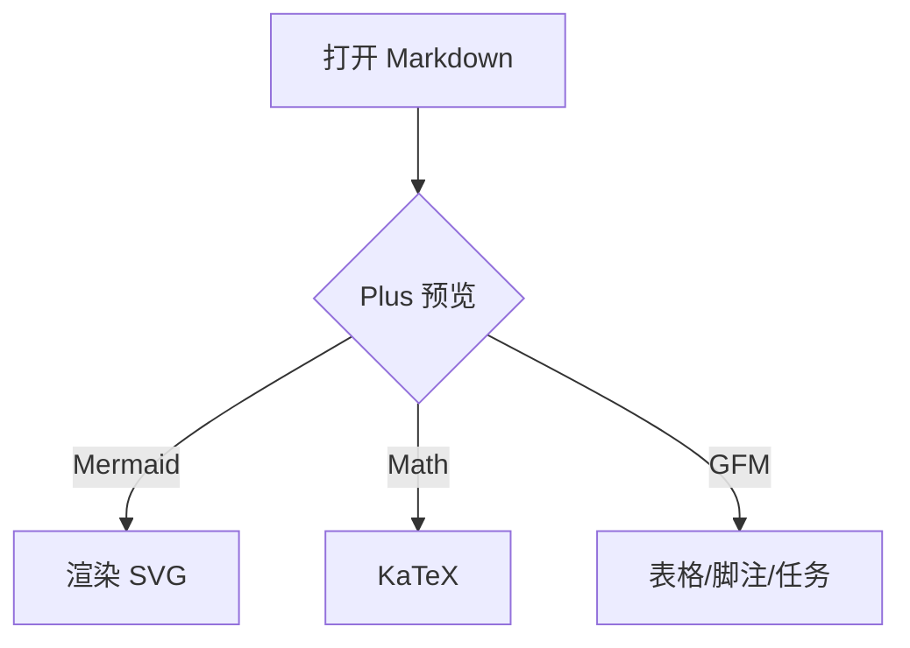
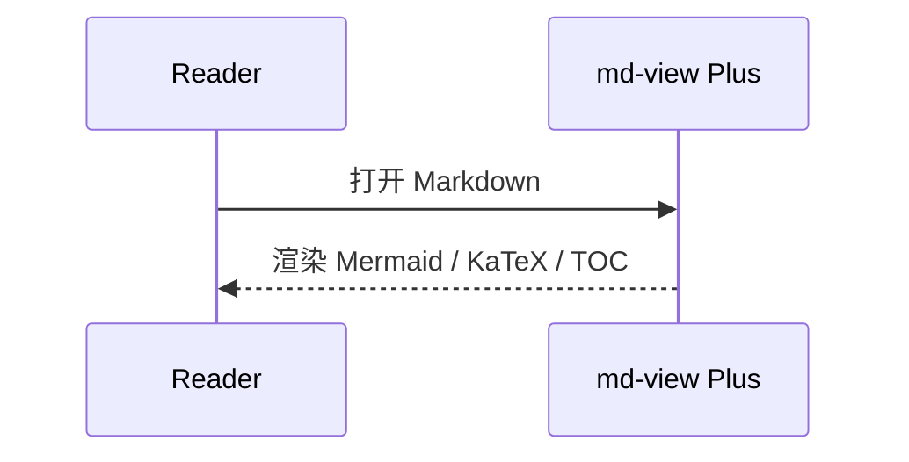

# Plus Markdown 语法样例

这份文档用于检查 Plus 版预览显示。它覆盖 CommonMark、GFM、数学公式、Mermaid 和常见 Markdown 方言。

[toc]

## 基础语法

普通段落支持 **粗体**、*斜体*、***粗斜体***、~~删除线~~、`inline code`、[内部跳转](#mermaid)、https://example.com 和邮箱 test@example.com。

断链测试：[不存在的文件](./missing-note.md) 与 [不存在的标题](#missing-heading) 应显示警告。

> 引用内容。
>
> 多段引用也应该保持间距。

> [!NOTE]
> 这是一个 GitHub/Obsidian 风格提示块。

> [!WARNING] 自定义标题
> 这是一个警告块。

## 列表

- 无序列表
- [ ] 未完成任务
- [x] 已完成任务

1. 有序列表
2. 第二项
   - 嵌套项

## 表格

| 语法 | 状态 | 说明 |
| --- | :---: | ---: |
| GFM table | 已支持 | 宽表格应该横向滚动 |
| task list | 已支持 | checkbox 只读显示 |
| footnote | 已支持 | 见脚注 |

## 代码块

```ts
type MarkdownFeature = {
  name: string;
  enabled: boolean;
};

const feature: MarkdownFeature = { name: 'highlight', enabled: true };
```

## 数学公式

行内公式：$E = mc^2$。

块级公式：

$$
\int_0^1 x^2 dx = \frac{1}{3}
$$

## Mermaid





## 定义列表

Markdown
: 一种轻量标记语言。

Plus
: md-view 的增强预览版本。

## 常见扩展

高亮：==important text==

插入：++inserted text++

下标：H~2~O

上标：x^2^

键盘标签：<kbd>Ctrl</kbd> + <kbd>S</kbd>

折叠内容：

<details>
<summary>展开查看更多</summary>

这里是 HTML details 内容。

</details>

## 导出

Plus 设置面板提供导出 HTML 和打印/PDF。HTML 导出应保留当前主题、渲染后的公式和图表。

## 脚注

这是一句带脚注的文字。[^note]

[^note]: 这是脚注内容，应该显示在文末并可点击返回。
